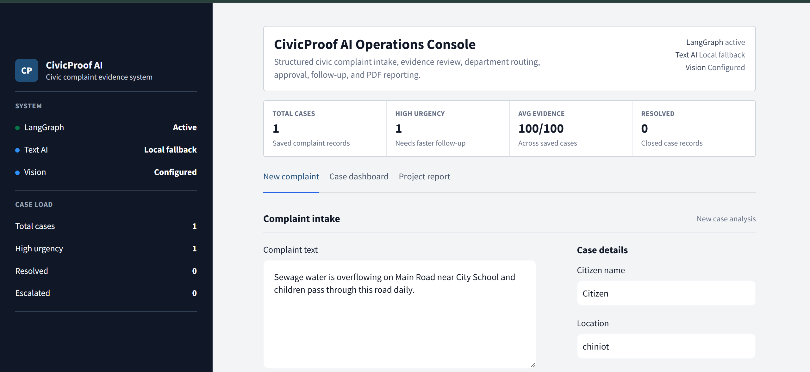
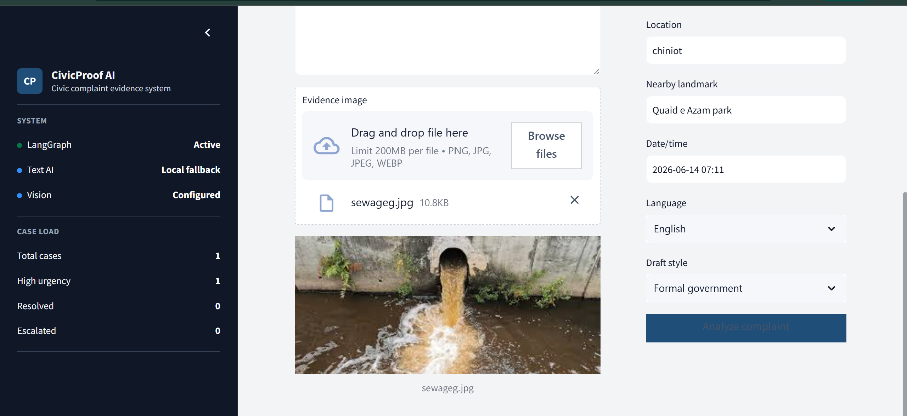
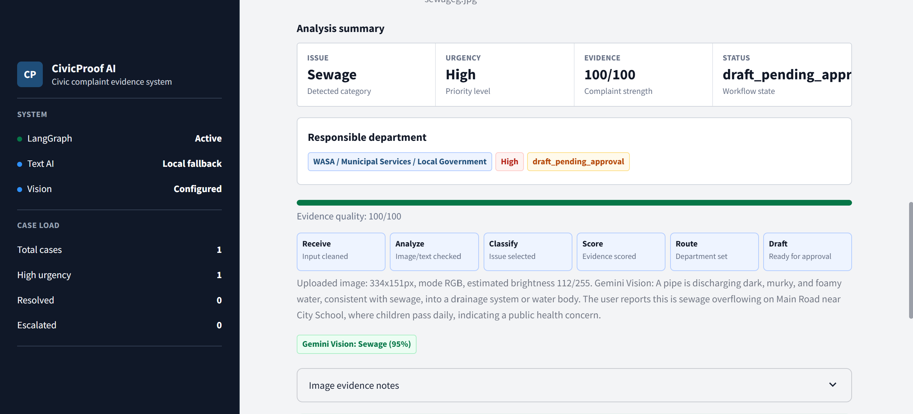
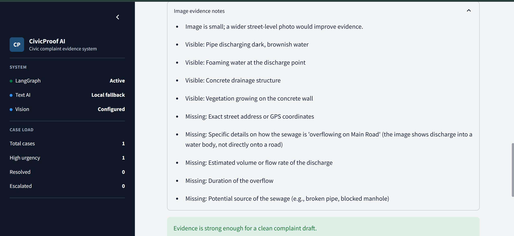
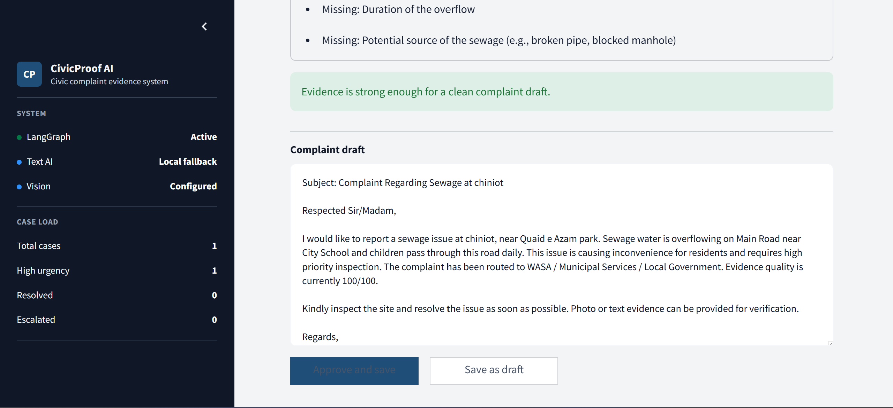
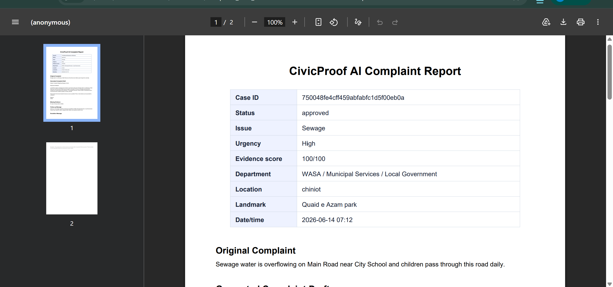
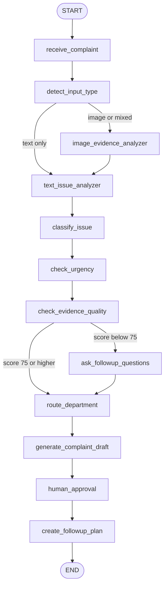

# CivicProof AI

Smart civic complaint and evidence agent built with **LangGraph**, **Streamlit**, **SQLite**, and **ReportLab**.

CivicProof AI turns messy citizen reports into structured civic complaint cases. A user can enter complaint text, attach optional image evidence, review a generated complaint draft, approve or save the case, and export a PDF report. The main purpose of this repository is to demonstrate how a real LangGraph application works with **state**, **nodes**, **edges**, conditional routing, and a human approval step.



## Why This Project

Most chatbot demos hide the application flow inside one prompt. CivicProof AI is different: the workflow is explicit and inspectable. Each stage updates a typed state object, and LangGraph decides the next step based on that state.

This makes the project useful for learning:

- How LangGraph `StateGraph` is created and compiled.
- How nodes read and update shared state.
- How edges connect deterministic steps.
- How conditional edges route text-only, image, and weak-evidence complaints.
- How to keep a human approval gate before saving generated output.
- How an AI workflow connects to a normal app UI, database, and PDF export.

## Screenshots

| Complaint intake | Evidence upload |
|---|---|
|  |  |

| LangGraph analysis | Evidence notes |
|---|---|
|  |  |

| Draft approval | PDF report |
|---|---|
|  |  |

## Core Features

- Text and image complaint intake.
- LangGraph workflow with 12 named nodes.
- Conditional routing for text-only, image, and mixed complaints.
- Civic issue classification for garbage, sewage, road damage, streetlight, and water leakage.
- Evidence score with missing-detail follow-up questions.
- Department routing based on issue category.
- Formal government, short WhatsApp, and escalation draft styles.
- Human approval before case persistence.
- SQLite case history.
- PDF case export with ReportLab.
- Optional Groq, OpenAI, and Gemini hooks.
- Local fallback mode, so the app runs without API keys.

## LangGraph Workflow

The main graph lives in [`src/civicproof/agent.py`](src/civicproof/agent.py). It follows this flow:



### State

The shared state is defined in [`src/civicproof/state.py`](src/civicproof/state.py) as `CivicState`. It carries the complaint from raw input to final case output:

- Input fields: complaint text, image path, citizen name, location, landmark, date/time.
- Analysis fields: input type, image summary, extracted problem, issue category, urgency.
- Evidence fields: evidence score, missing details, follow-up questions.
- Routing fields: responsible department.
- Output fields: complaint draft, follow-up message, escalation message.
- Persistence fields: case ID, approval status, case status, node trace.

### Nodes

Each LangGraph node is a normal Python function that receives `CivicState` and returns updates:

| Node | Purpose |
|---|---|
| `receive_complaint` | Normalize complaint text and basic details. |
| `detect_input_type` | Decide whether the case is text, image, or mixed. |
| `image_evidence_analyzer` | Analyze uploaded images locally and with Gemini Vision when configured. |
| `text_issue_analyzer` | Extract problem summary and optional LLM entities. |
| `classify_issue` | Detect the civic issue category. |
| `check_urgency` | Estimate Low, Medium, or High urgency. |
| `check_evidence_quality` | Score complaint strength and find missing details. |
| `ask_followup_questions` | Generate targeted questions for weak evidence. |
| `route_department` | Choose the responsible civic department. |
| `generate_complaint_draft` | Draft the formal complaint. |
| `human_approval` | Pause the workflow for user review and approval. |
| `create_followup_plan` | Generate follow-up and escalation messages. |

### Edges

The graph uses two important conditional edges:

- `detect_input_type` routes image and mixed complaints through image analysis.
- `check_evidence_quality` routes low-score complaints through follow-up questions before department routing.

This is the main LangGraph lesson in the project: the app is not just calling an LLM once. It is moving a state object through a controlled graph where each node has a specific job.

## Tech Stack

- **LangGraph** for workflow orchestration.
- **Streamlit** for the operations console.
- **SQLite** for local case history.
- **ReportLab** for complaint PDFs.
- **Pillow** for local image evidence checks.
- **python-dotenv** for optional provider configuration.
- **pytest** for regression tests.

## Run Locally

```powershell
python -m venv .venv
.\.venv\Scripts\Activate.ps1
python -m pip install -r requirements.txt
streamlit run app.py
```

The app runs without API keys using deterministic local rules.

## Sample Input

Use this in the **New complaint** tab:

```text
Complaint text:
Sewage water is overflowing on Main Road near City School and children pass through this road daily.

Citizen name:
Ali Khan

Location:
Main Road, Model Town

Nearby landmark:
City School

Date/time:
2026-06-14 18:30

Language:
English

Draft style:
Formal government
```

Expected result:

- Issue: `Sewage`
- Urgency: `High`
- Department: `WASA / Municipal Services / Local Government`
- Output: formal complaint draft, follow-up message, escalation message, and optional PDF report.

## Optional AI Setup

Copy `.env.example` to `.env` and choose a text provider only when you want stronger generated summaries or drafts.

```env
CIVICPROOF_LLM_PROVIDER=groq
GROQ_API_KEY=your_key_here
GROQ_MODEL=llama-3.3-70b-versatile
```

For image understanding, add a Gemini key:

```env
GEMINI_API_KEY=your_key_here
GEMINI_VISION_MODEL=gemini-2.5-flash
```

Without Gemini, uploaded images still count as evidence and are checked locally for size and brightness with Pillow.

## Tests

```powershell
pytest
```

Current test coverage checks issue analysis, database persistence, and PDF generation.

## Project Structure

```text
app.py                          Streamlit application
src/civicproof/agent.py          LangGraph workflow
src/civicproof/state.py          Typed graph state
src/civicproof/analysis.py       Classification, scoring, drafting
src/civicproof/image_tools.py    Local image evidence checks
src/civicproof/llm.py            Optional Groq, OpenAI, Gemini clients
src/civicproof/db.py             SQLite persistence
src/civicproof/pdf_report.py     PDF export
docs/langgraph_workflow.md       Detailed LangGraph notes
docs/screenshots/                UI and report screenshots
docs/CivicProof_AI_Project_Report.pdf
tests/                           Pytest suite
```

## Documentation

- [LangGraph workflow notes](docs/langgraph_workflow.md)
- [Project report PDF](docs/CivicProof_AI_Project_Report.pdf)

## License

MIT License. See [`LICENSE`](LICENSE).
