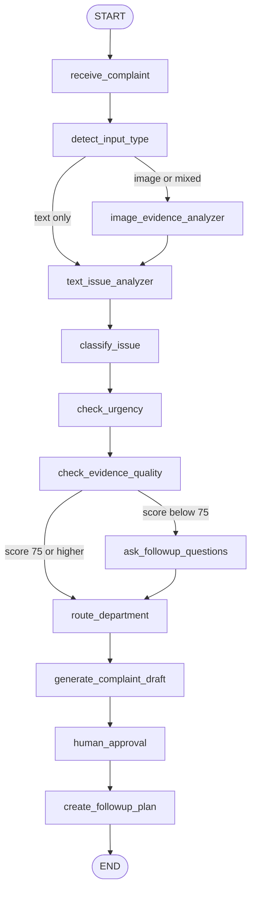
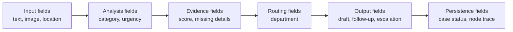
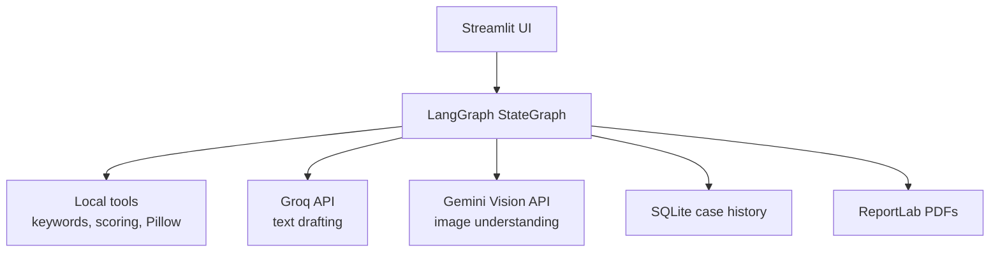
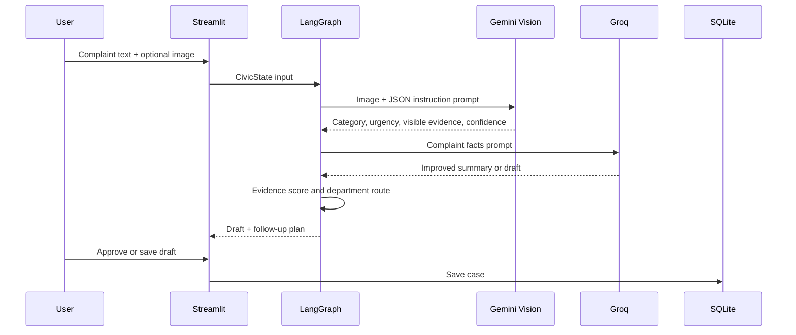

# CivicProof AI LangGraph Workflow

CivicProof AI uses LangGraph as a stateful workflow engine. The graph starts with a complaint, decides whether the input includes an image, classifies the civic issue, scores evidence quality, routes weak evidence through follow-up questions, selects a department, drafts the complaint, marks it for human approval, and creates follow-up and escalation text.

## Complete Flow

## Node Count

The graph has **12 LangGraph nodes**, plus the `START` and `END` graph markers.

| # | Node | Main purpose |
|---|---|---|
| 1 | `receive_complaint` | Normalize complaint text, location, citizen details, and date/time. |
| 2 | `detect_input_type` | Decide whether the input is text, image, or mixed. |
| 3 | `image_evidence_analyzer` | Use Pillow locally and Gemini Vision when configured. |
| 4 | `text_issue_analyzer` | Extract complaint summary and optional LLM hints. |
| 5 | `classify_issue` | Classify issue category. |
| 6 | `check_urgency` | Set Low, Medium, or High urgency. |
| 7 | `check_evidence_quality` | Score evidence and list missing details. |
| 8 | `ask_followup_questions` | Ask targeted questions for weak evidence. |
| 9 | `route_department` | Select responsible civic department. |
| 10 | `generate_complaint_draft` | Generate formal or short complaint draft. |
| 11 | `human_approval` | Mark the case as pending approval. |
| 12 | `create_followup_plan` | Generate follow-up and escalation text. |

## State Movement

The main state object is `CivicState`. It carries the complaint text, image path, location, landmark, issue category, urgency level, evidence score, missing details, department, generated draft, approval status, follow-up message, escalation message, and node trace.

## Tool Flow

## Prompt Flow

## Conditional Routing

- `detect_input_type` sends image and mixed complaints through image analysis.
- `check_evidence_quality` sends weak complaints through targeted follow-up questions.
- The app only saves a case after the human approves the generated draft or explicitly saves it as a draft.

When `GEMINI_API_KEY` is configured, `image_evidence_analyzer` sends the uploaded image to Gemini Vision and asks for structured JSON containing summary, issue category, urgency, visible evidence, missing details, and confidence. If Gemini is unavailable, the node falls back to local Pillow checks for image size and brightness.
